# Criando Servidor  VPN com Raspberrypi

Na preparação do raspberry pi, foi utilizado esse repositório:

https://www.filipeflop.com/blog/pivpn-transforme-sua-raspberry-pi-em-um-servidor-vpn/

Conectando no raspberry pi na rede interna:

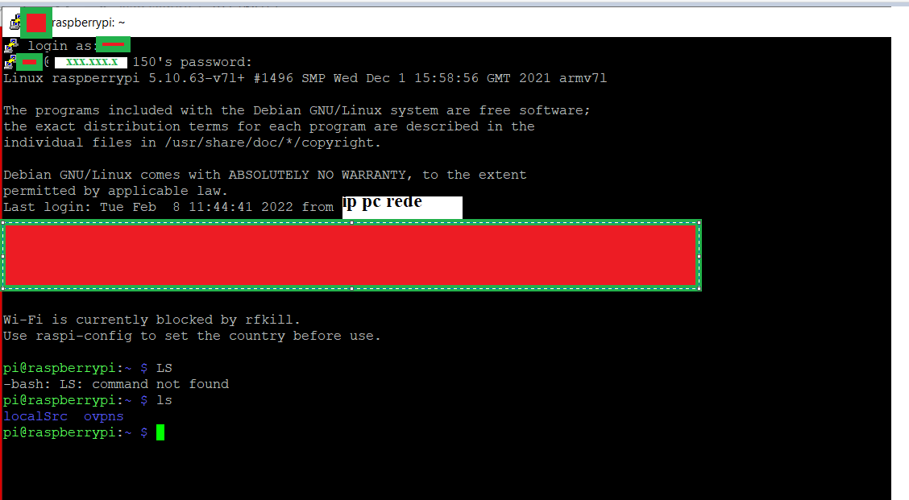

### Configurações do roteador Claro:

**Menu/avancado/encaminhamento de porta:**

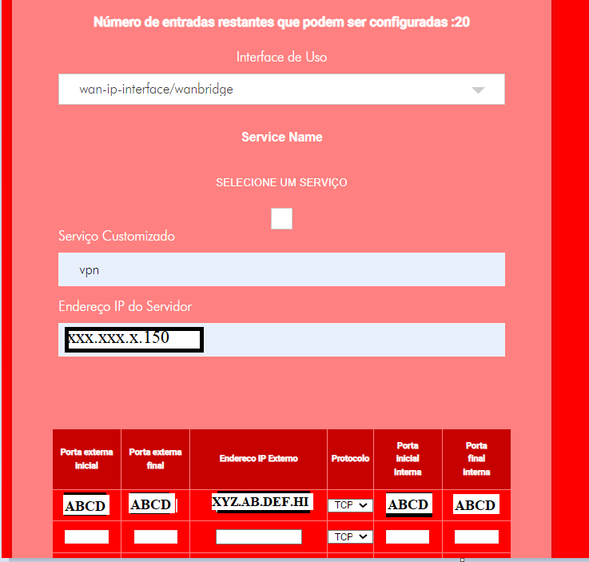

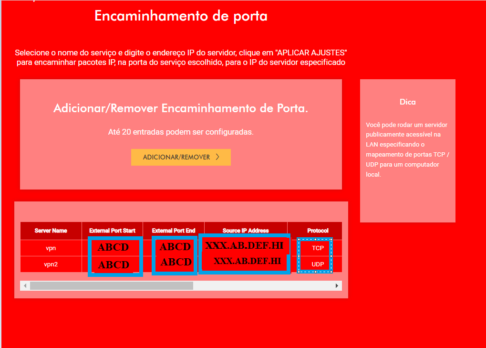

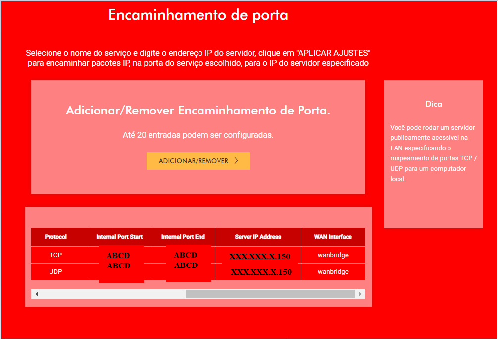

**Menu/avancado/DMZ host:**

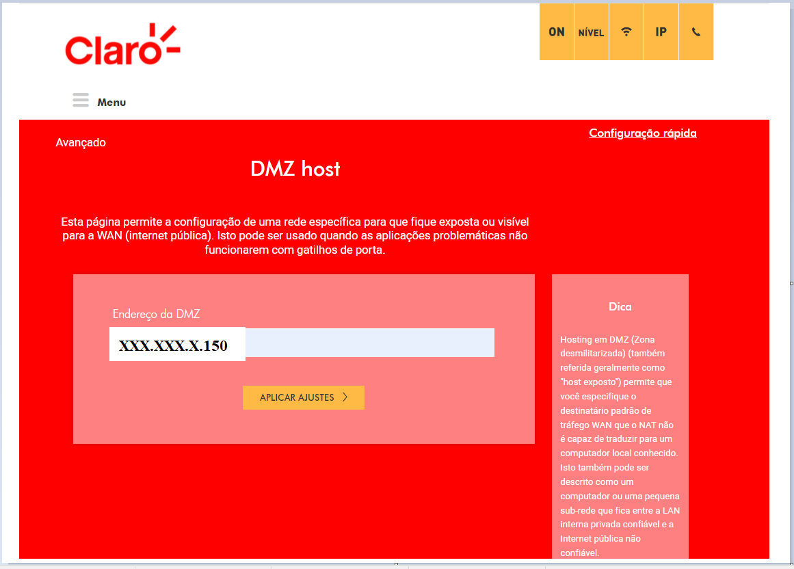
						   
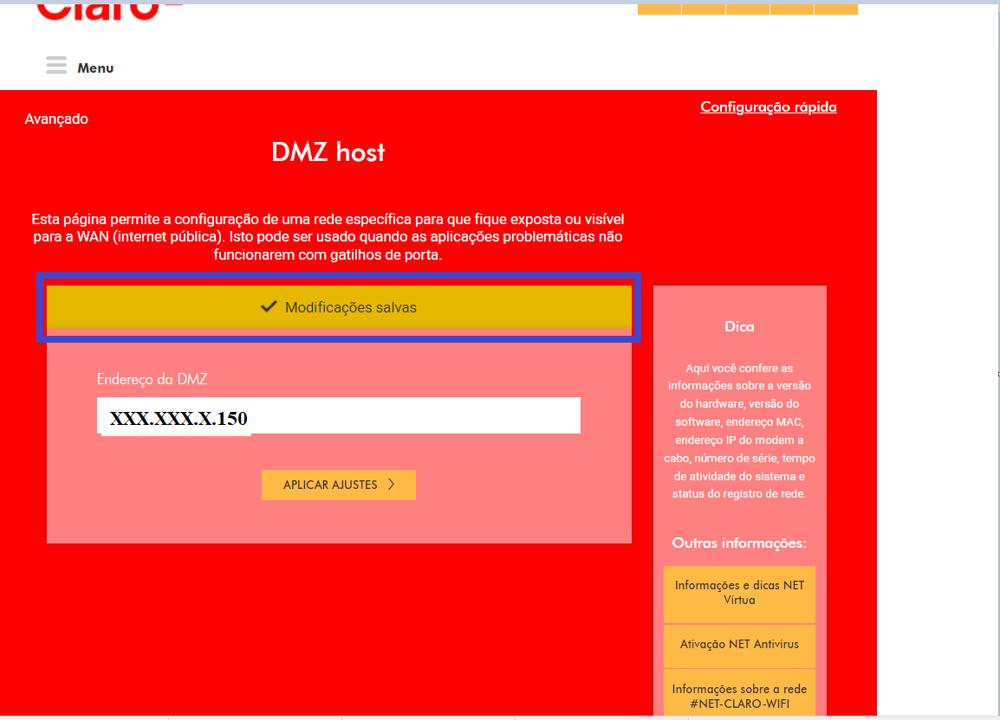

**Menu/avancado/gatilho de portas:**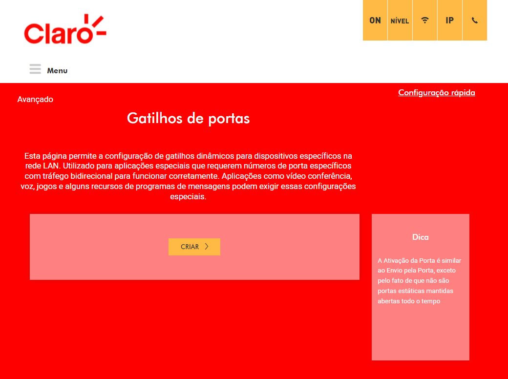
						   
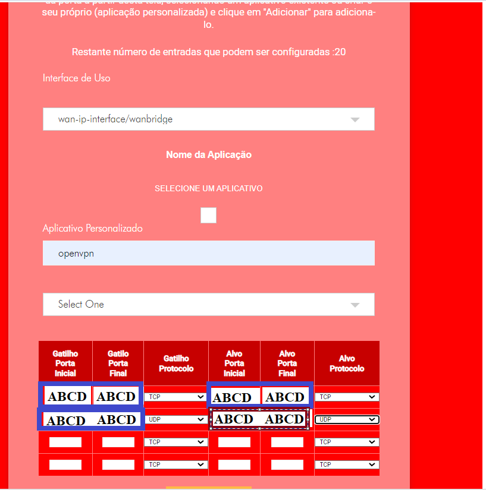
						   
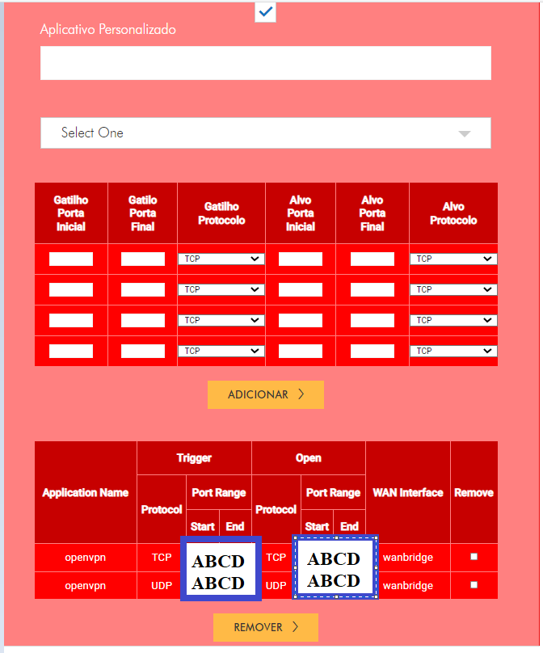

**Testando Portas abertas**

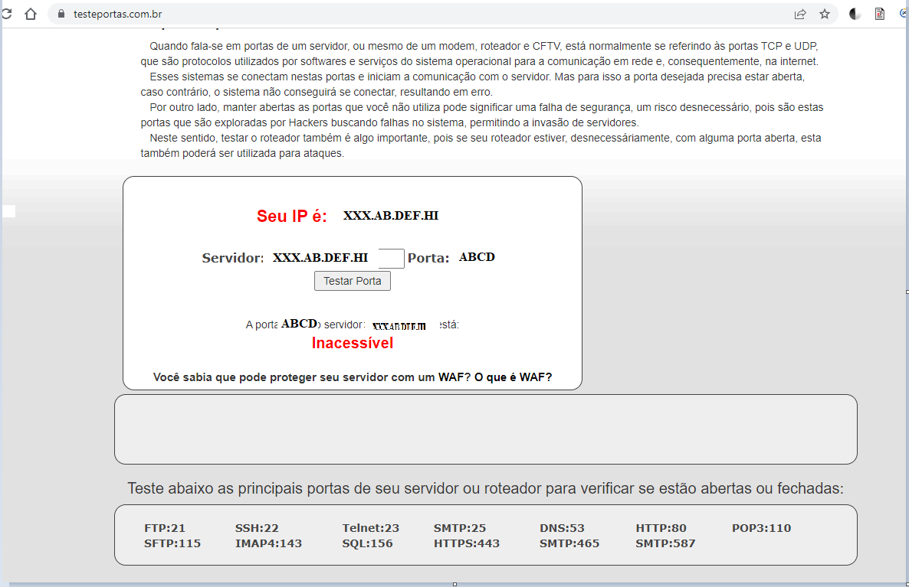

###### log de erro do celular:

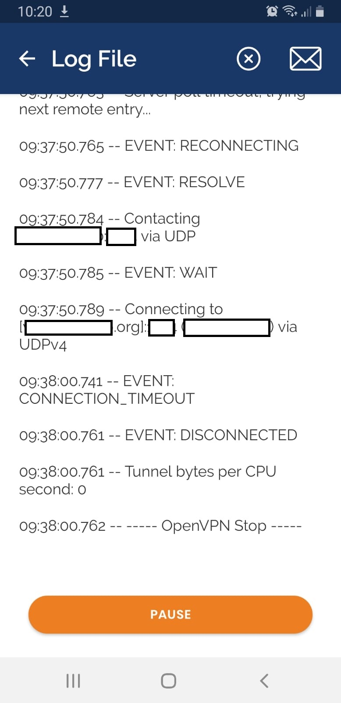

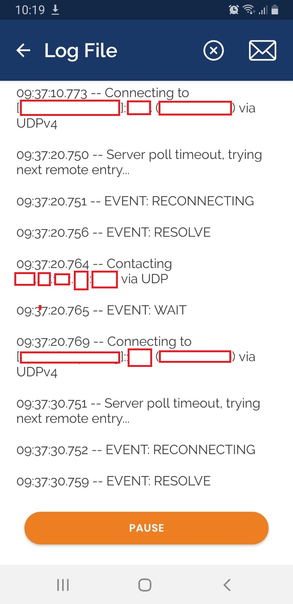

### Conclusão:

Não consegui conectar com o raspberry pi com openvpn. Acredito que o motivo é que a porta ABCD não está liberada, no roteador da claro.