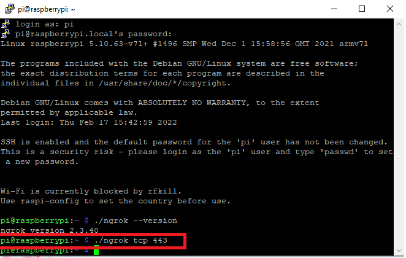
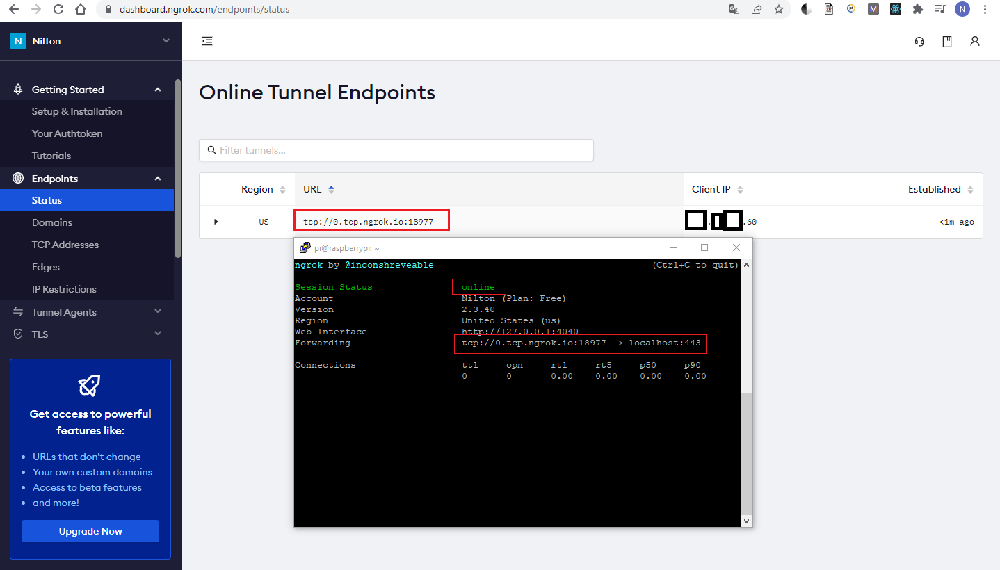

# **Como criar uma VPN com Raspberry pi, sem a necessidade de liberar portas no roteador do Provedor de Internet.**


Há vários tutoriais¹ mostrando com implementar uma VPN usando Raspberry pi, porém uma parte do processo é a liberação de portas do roteador do provedor de internet. No entanto, nesta etapa encontramos dificuldade pois o provedor não permitia a liberação, para reverter esta barreira utilizamos o serviço [Ngrok](https://ngrok.com/docs), que expõe o servidor local à internet publica, que estão atrás de firewall e [NAT](https://pt.wikipedia.org/wiki/Network_address_translation).

### Instalação da VPN no Raspberry pi:

Seguimos este [tutorial](https://www.filipeflop.com/blog/pivpn-transforme-sua-raspberry-pi-em-um-servidor-vpn/).

### Instalação do Ngrok no Raspberry pi:

 baixar, descompactar e verificar a versão do ngrok instalado.

```bash
wget https://bin.equinox.io/c/4VmDzA7iaHb/ngrok-stable-linux-arm.zip
unzip ngrok-stable-linux-arm.zip
./ngrok --version
```

Outras opções de instalação:

Utilizar  a versão **linux ARM** disponível [aqui](https://ngrok.com/download).


Após a instalação do Ngrok no raspberry pi é necessário criar um tunel  com o protocolo **tcp** do ngrok e usar o **pivpn** instalado anteriormente para autenticar a conexão.

1. Criando um tunnel tcp com ngrok.

   ``./ngrok tcp 443``

   
   

   Nestas imagens podemos verificar que a porta liberada pelo serviço ngrok, foi a de número **18977**. Este número deve ser e o enderenço **0.tcp.ngrok.io** serão utilizados no certificado de conexão do **pivpn**.

2. Criar certificado com pivpn para autenticar a conexão.
   `pivpn add` ou `pivpn ovpn add` (caso no raspberry pi, tenha openvpn e wireguard instalados).

   

   

   Após a execução dos passos marcados acima, um arquivo na pasta **/home/pi/ovpns** , que deverá ser copiado e editado para o cliente que conectará ao servidor. Neste exemplo, o cliente será um telefone android. Utilizaremos o Winscp para copiar o arquivo.

   

   As marcações em **vermelho** são os campos que devem ser alterados. Este arquivo deve ser enviado ao celular para permitir a conexão ao servidor usando a **VPN**.

   

3. Conectando ao servidor, usando o celular:
   

   

   

   

2. .....


[^1]: https://www.filipeflop.com/blog/pivpn-transforme-sua-raspberry-pi-em-um-servidor-vpn/