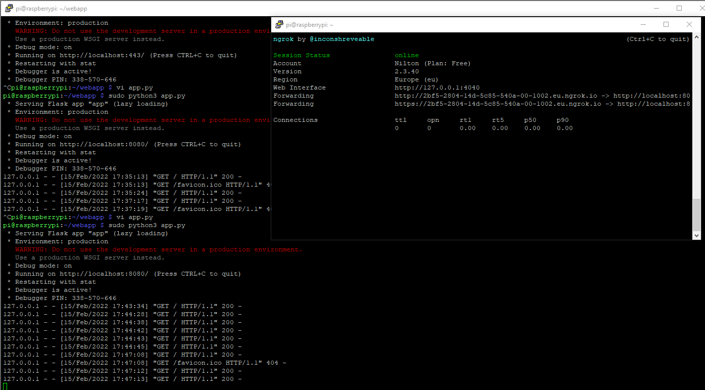
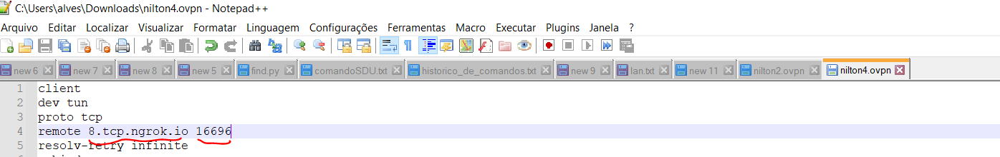
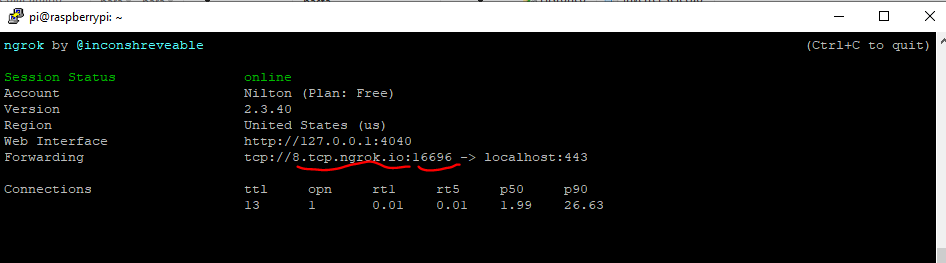

app.py

```python
from flask import Flask

app = Flask(__name__)

@app.route('/')
def index():
    return 'Hello ESF volunteer'

if __name__ == '__main__':
	app.run(host="localhost", port=8080, debug=True)
```


`/home/pi/ngrok http -region eu 8080`

`/home/pi/ngrok http -region eu 51820`

`./ngrok http 8080`

 http://2bf5-2804-14d-5c85-540a-00-1002.eu.ngrok.io 




##### Para conectar no raspberry pi usando VPN + ngrok 

1. editar o certificado gerado pelo `pivpn add`, alterando o ip e a porta. Que deverão ser os informados no ngrok.

2. `./ngrok tcp 443`

3. Na instalacao do pivpn usei a configuracao de tcp, ao inves de udp que é padrao.

   

   